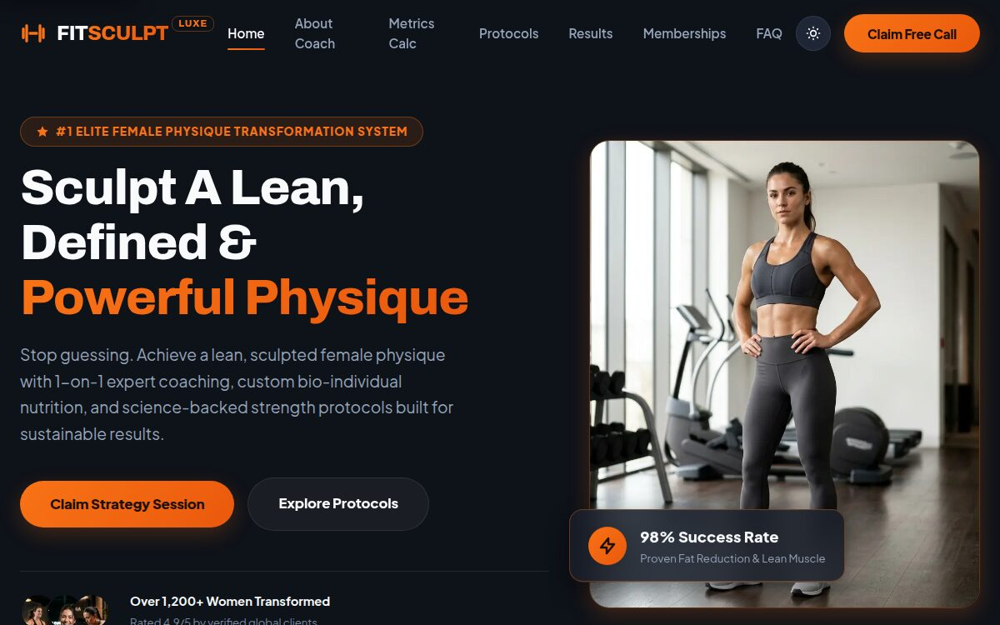

# FitSculpt Pro

A single-page landing template for physique and body-sculpting coaches. Dark
interface, built around getting the visitor to book a call.

**Live demo: [fitsculpt-pro.pages.dev](https://fitsculpt-pro.pages.dev/)**

[](https://fitsculpt-pro.pages.dev/)

The demo copy is written for a coach working with women on strength and physique,
and the sections follow that: protocols rather than a generic service list, a
metrics calculator, before-and-after results, membership tiers. Swap the text and
the same structure serves any coaching practice that sells programmes.

Written by hand in HTML, CSS and JavaScript, assembled with Vite. No framework, no
CMS, no bought theme underneath.

Published as a code reference — this is what my markup and CSS actually look like.
Read it, take it apart, build on it.

**Free to use, modify and deploy — personal projects and client work included.**
You may not redistribute or sell it as a template, theme or starter kit, modified
or not. Full terms in [LICENSE](LICENSE).

## What's in it

- **One landing page** — coach, calculator, programs, results, memberships, FAQ
  and the contact form are all sections of `index.html`, reached by anchor from a
  single navigation bar. Nothing that converts is a click away.
- **Three supporting documents** — privacy policy, disclaimer and a custom 404,
  sharing the same header and footer
- **Legal scaffolding** — a GDPR-shaped privacy policy and a disclaimer covering
  AI-generated imagery, fictional testimonials and health claims, both linked from
  the footer of every page, with the parts you must fill in marked inline
- **BMI and calorie calculator** — height, weight and activity level in, result out,
  without leaving the page
- **Filterable program grid** for splitting training plans by type
- **Monthly / annual pricing toggle**
- **One lead schema, two surfaces** — the booking dialog and the contact section
  collect the same four fields, and every CTA tells the dialog which programme or
  membership it came from, so the request arrives with its context attached
- **Responsive images** — two WebP widths per photo with real `sizes`, so a phone
  pulls ~138 KB of imagery instead of the desktop's ~288 KB
- **Light and dark themes** — the first visit follows `prefers-color-scheme`, the
  choice is then remembered in `localStorage` and applied before first paint

## Stack

Vanilla JavaScript and modular CSS, bundled with Vite. Styles are split by concern —
tokens, reset, layout, components, sections — and scripts by feature.

```
index.html              the landing page — every section lives here
404.html                at the root, where a host looks for it
pages/                  privacy, disclaimer
src/styles/             theme, base, layout, components, sections, main
src/scripts/            theme, calculator, modal, animations, main
vite.config.js
```

The 404 sits at the root because that is where Cloudflare Pages, Netlify and
GitHub Pages go looking for it — under `pages/` it builds fine and is never
served. Its links are absolute for the same reason: it answers for any unknown
URL at any depth, so a relative `privacy.html` would resolve somewhere different
every time.

## Run it locally

Node 20.19 or newer (22.12+ on the 22 line) — what Vite 8 asks for.

```bash
git clone https://github.com/aledtr77/template-fitsculpt-pro.git
cd template-fitsculpt-pro
npm install
npm run dev      # http://localhost:3000
npm run build    # static output in dist/
```

The build is plain static files. Deploy them on Cloudflare Pages, Netlify, Vercel, a
GitHub Pages user site or any custom domain without changes — the demo linked above is
that `dist/` folder, unedited.

One exception: a GitHub Pages **project** site serves from a subpath
(`user.github.io/repo/`), and the emitted asset URLs are absolute. Set `base: '/repo/'`
in `vite.config.js` for that case, or every stylesheet, script and image 404s.

## Before you publish it

Every photograph in this repository was generated with AI. No real models, actors or
clients appear anywhere in it. **The images are not covered by the licence — replace
them with your own** before putting anything online. The same goes for the copy: every
headline, price, statistic and testimonial is filler text, and "Coach Elena Vance" is
an invented character.

That distinction matters legally, not just editorially. Publishing invented
testimonials, unearned credentials or unsubstantiated results claims as though they
were genuine is a misleading commercial practice under Directive 2005/29/EC — in Italy
the Codice del Consumo, enforced by the AGCM. Keep only what you can evidence.

**Fill in the legal pages.** `pages/privacy.html` and `pages/disclaimer.html` ship as
scaffolding, not as finished documents. Every spot needing your details is marked
`[LIKE THIS]` and rendered as a highlighted chip so it is impossible to miss on the
page. Replace them all, adapt the text to the services you actually run, and have a
professional review it. A policy published with the placeholders still in it is worse
than none. The demo-content notice in the footer applies as written for as long as the
AI imagery is still there — delete it once you have swapped in real photographs.

**Point the origins at your domain.** `og:url`, `og:image` and `rel="canonical"` on
every page, the `@id`/`url` fields in the JSON-LD block in `index.html`, and both
`public/robots.txt` and `public/sitemap.xml` all carry the demo's origin — a scraper
cannot resolve a relative path. Replace `public/og-image.jpg` with a card of your own.

**The structured data deliberately omits ratings.** `index.html` ships `WebSite`,
`ProfessionalService` and `FAQPage` JSON-LD, but no `AggregateRating` and no `Review`,
because the "4.9/5" and the testimonials on the page are invented. Marking invented
ratings up breaks Google's structured-data policy on top of the consumer-law problem.
Add them once you have genuine reviews, not before.

## The paid templates

This one is free. The other templates, each with its own visual direction and full
sources, are on **[Etsy](https://www.etsy.com/shop/CodedgeStudio)** — and the live
demos are browsable first at **[codedge.it/templates](https://codedge.it/templates/)**.

## Licence

Free to use, modify and deploy — personal projects and client work included. You may
not redistribute or sell it as a template, theme or starter kit, modified or not.
Full terms in [LICENSE](LICENSE).

Different terms, or a custom build? **contatti.codedge@gmail.com**
